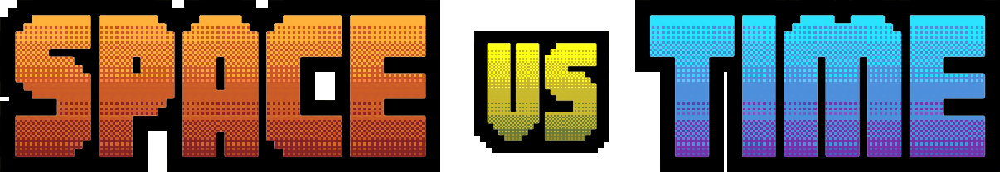

# Progetti client

Clona questo repository per prepararti al workshop "Space VS Time".
Scegli pure il progetto client con la tecnologia che preferisci. Sono disponibili questi tre:

- TypeScript per Node >= 20;
- C# per .NET 8;
- Rust.

Ciascun progetto ha un README specifico che indica come iniziare.

Buon divertimento!

